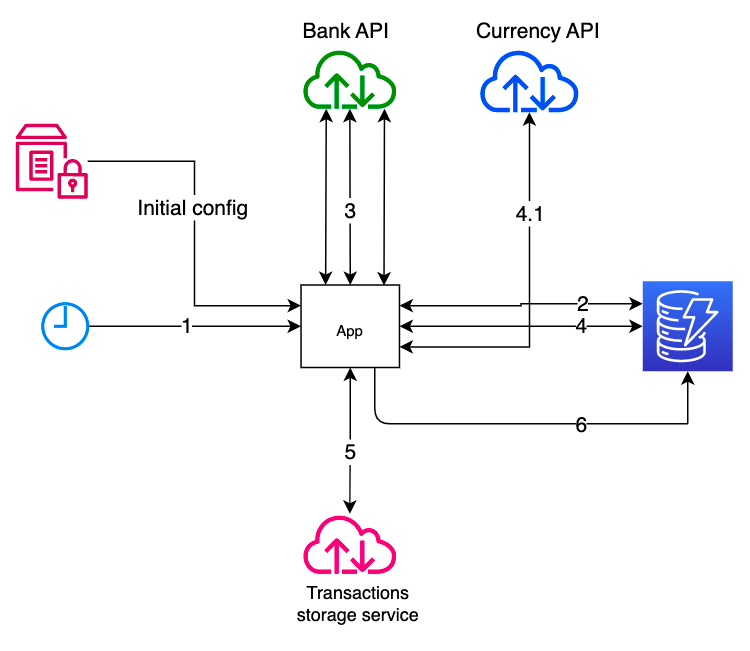

# README #

## General (simplified) picture

1. Time based event.
2. Selection of suitable users.
3. Selection of bank transactions/statements (in many threads). 
4. Currency selection from DB (4.1 if currency is not available in DB, then it should located on 3rd part service)
5. Upload to transactions/statements storage/service.
6. Updated DB.

## Overview
Supported banks:

- [Private bank (not for business)](https://www.privat24.ua/)

## Requirements

- Java 17
- Gradle 4 or more
- Docker 18.06.0+ and Docker-compose(3.7) 1.21+

## How to

To build (gradle push docker-compose with all params to server):

- Copy `gradle.properties.template` to `gradle.properties` where  `PB_SSH_HOST` and `PB_SSH_USER` - credentials for ssh
  login
- Run: `./gradlew clean build` to build application
- Copy `variables.env.template` to `variables.env` - settings for app in docker
  container; `./gradlew upladComposeFileToServer` - to push docker files to server

## Docker

On prod app is running in docker container check `docker-compose.yml`,  **watchtower** container is used for
auto-updates for the main container.

#### Docker swarm

To avoid JVM **out of memory error**  in docker container app must be executed in swarm mode in order to set docker
memory. Also it will be nice to have **swap** on the target system.

[Very basis expiation of the OOM problem](https://medium.com/@yortuc/jvm-memory-allocation-in-docker-container-a26bbce3a3f2)

Swarm commands:

- `docker stack rm sync`  - remove docker stack called *sync*

- `docker service logs sync_pb-integration` - show logs for one the stack containers

- `docker stack deploy -c docker-compose.yml sync` - run docker stack called *sync*

### How to insert custom comment generator

`INSERT INTO MERCHANT_INFO_ADDITIONAL_COMMENT ( MERCHANT_INFO_ID , ADDITIONAL_COMMENT ) VALUES ( 1, 'NBU_PREV_MOUTH_LAST_BUSINESS_DAY')`

## Links

1. [How configure ssh auto deploy via pipeline](https://community.atlassian.com/t5/Bitbucket-questions/How-do-I-set-up-ssh-public-key-authentication-so-that-I-can-use/qaq-p/171671)
2. [Top-like interface for container metrics](https://github.com/bcicen/ctop) 
